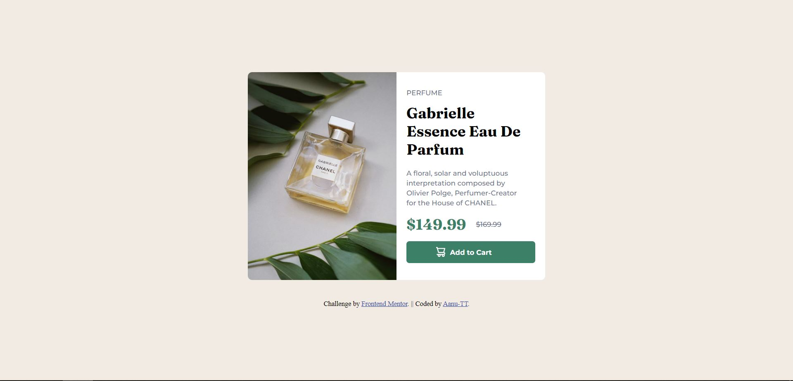

# Frontend Mentor - Product preview card component solution

This is a solution to the [Product preview card component challenge on Frontend Mentor](https://www.frontendmentor.io/challenges/product-preview-card-component-GO7UmttRfa). Frontend Mentor challenges help you improve your coding skills by building realistic projects. 

## Table of contents

  - [The challenge](#the-challenge)
  - [Screenshot](#screenshot)
  - [Links](#links)
- [My process](#my-process)
  - [Built with](#built-with)
  

### The challenge

Users should be able to:

- View the optimal layout depending on their device's screen size: check
- See hover and focus states for interactive elements :hover check

### Screenshot

### Links

- Solution URL: [Add solution URL here](https://github.com/Aanu-TT/2_product-preview-card-component-main/blob/main/style.css)
- Live Site URL: [Add live site URL here](https://2-product-preview-card-component-main.vercel.app/)

## My process

This project took me 3 days to complete.

### Built with

- Semantic HTML5 markup
- CSS custom properties
- Flex box

